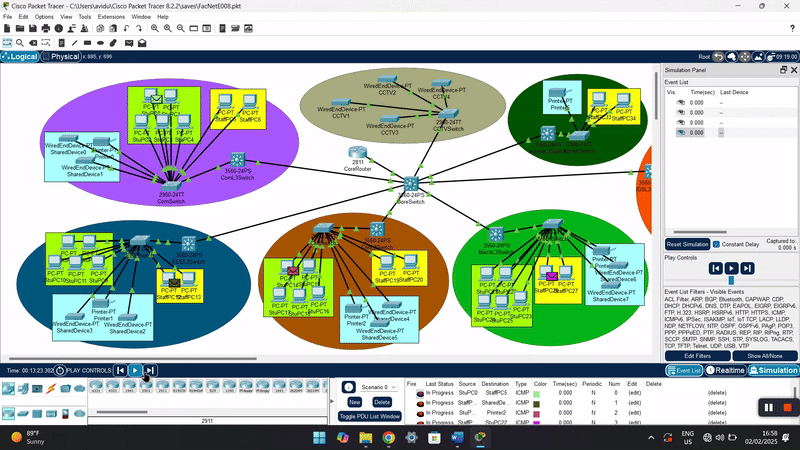

# Network-Simulation-UOJ-FOE
This project designs a scalable and efficient VLAN-based network for an educational institution, covering multiple engineering departments. The network uses subnetting and VLAN segmentation to optimize performance and security.

  
*Screenrecord of the network topology simulation*  

## 📌 Project Overview  
This project focuses on designing a **scalable and efficient VLAN-based network** for an educational institution. The network is structured with **Layer 3 switching and subnetting** to ensure optimal performance, security, and future scalability.  

## 📁 Key Features  
✅ **Subnetting & VLAN Segmentation** – Organized IP allocation for efficient traffic management.  
✅ **Layer 3 Switching & Inter-VLAN Routing** – Faster and more reliable data communication.  
✅ **VLAN Trunking** – Allows seamless expansion without major reconfiguration.  
✅ **Quality of Service (QoS)** – Prioritizes administrative and security traffic.  
✅ **Future Scalability** – Supports a 30% increase in connected devices.  

## 🏗️ Network Design  
The network is divided into **departments**, each with **dedicated VLANs** for students, staff, and other devices. Below is a summary:  

*Subnet Calculations*  

| Department      | Device Type     | Total Devices | Future Growth (30%) | Required Hosts | Subnet Mask              | Network Address  | Usable IP Range                  | Broadcast Address  |
|---------------|----------------|--------------|--------------------|---------------|------------------------|-----------------|--------------------------------|-----------------|
| **Computer Eng** | Students       | 250          | 325                | 512           | 255.255.254.0 (/23)     | 192.168.0.0     | 192.168.0.1 - 192.168.1.254    | 192.168.1.255   |
|               | Staff           | 50           | 65                 | 128           | 255.255.255.128 (/25)   | 192.168.2.0     | 192.168.2.1 - 192.168.2.126    | 192.168.2.127   |
|               | Other Devices   | 27           | 35                 | 64            | 255.255.255.192 (/26)   | 192.168.2.128   | 192.168.2.129 - 192.168.2.190  | 192.168.2.191   |
| **EE Eng**     | Students       | 150          | 195                | 256           | 255.255.255.0 (/24)     | 192.168.3.0     | 192.168.3.1 - 192.168.3.254    | 192.168.3.255   |
|               | Staff           | 50           | 65                 | 128           | 255.255.255.128 (/25)   | 192.168.4.0     | 192.168.4.1 - 192.168.4.126    | 192.168.4.127   |
|               | Other Devices   | 17           | 22                 | 32            | 255.255.255.224 (/27)   | 192.168.4.128   | 192.168.4.129 - 192.168.4.158  | 192.168.4.159   |
| **Civil Eng**  | Students       | 75           | 98                 | 128           | 255.255.255.128 (/25)   | 192.168.5.0     | 192.168.5.1 - 192.168.5.126    | 192.168.5.127   |
|               | Staff           | 25           | 33                 | 64            | 255.255.255.192 (/26)   | 192.168.5.128   | 192.168.5.129 - 192.168.5.190  | 192.168.5.191   |
|               | Other Devices   | 7            | 10                 | 16            | 255.255.255.240 (/28)   | 192.168.5.192   | 192.168.5.193 - 192.168.5.206  | 192.168.5.207   |
| **Mech Eng**   | Students       | 75           | 98                 | 128           | 255.255.255.128 (/25)   | 192.168.6.0     | 192.168.6.1 - 192.168.6.126    | 192.168.6.127   |
|               | Staff           | 25           | 33                 | 64            | 255.255.255.192 (/26)   | 192.168.6.128   | 192.168.6.129 - 192.168.6.190  | 192.168.6.191   |
|               | Other Devices   | 12           | 16                 | 32            | 255.255.255.224 (/27)   | 192.168.6.192   | 192.168.6.193 - 192.168.6.222  | 192.168.6.223   |
| **IDS**        | Students       | 15           | 20                 | 32            | 255.255.255.224 (/27)   | 192.168.7.0     | 192.168.7.1 - 192.168.7.30     | 192.168.7.31    |
|               | Staff           | 25           | 33                 | 64            | 255.255.255.192 (/26)   | 192.168.7.32    | 192.168.7.33 - 192.168.7.94    | 192.168.7.95    |
|               | Other Devices   | 7            | 10                 | 16            | 255.255.255.240 (/28)   | 192.168.7.96    | 192.168.7.97 - 192.168.7.110   | 192.168.7.111   |
| **Administration** | Staff       | 25           | 33                 | 64            | 255.255.255.192 (/26)   | 192.168.8.0     | 192.168.8.1 - 192.168.8.62     | 192.168.8.63    |
|               | Printers        | 5            | 7                  | 16            | 255.255.255.240 (/28)   | 192.168.8.64    | 192.168.8.65 - 192.168.8.78    | 192.168.8.79    |
| **CCTV System** | CCTV Cameras  | 50           | 65                 | 128           | 255.255.255.128 (/25)   | 192.168.9.0     | 192.168.9.1 - 192.168.9.126    | 192.168.9.127   |

*VLAN & Subnet Table*  

| Department      | VLAN ID | Device Type     | Subnet               | Subnet Mask            | Network Address  |
|---------------|--------|----------------|--------------------|----------------------|-----------------|
| **Computer Eng** | 10     | Students       | 192.168.0.0/23     | 255.255.254.0        | 192.168.0.0     |
|               | 20     | Staff           | 192.168.2.0/25     | 255.255.255.128      | 192.168.2.0     |
|               | 30     | Other Devices   | 192.168.2.128/26   | 255.255.255.192      | 192.168.2.128   |
| **EEE**        | 40     | Students       | 192.168.3.0/24     | 255.255.255.0        | 192.168.3.0     |
|               | 50     | Staff           | 192.168.4.0/25     | 255.255.255.128      | 192.168.4.0     |
|               | 60     | Other Devices   | 192.168.4.128/27   | 255.255.255.224      | 192.168.4.128   |
| **Civil Eng**  | 70     | Students       | 192.168.5.0/25     | 255.255.255.128      | 192.168.5.0     |
|               | 80     | Staff           | 192.168.5.128/26   | 255.255.255.192      | 192.168.5.128   |
|               | 90     | Other Devices   | 192.168.5.192/28   | 255.255.255.240      | 192.168.5.192   |
| **Mech Eng**   | 100    | Students       | 192.168.6.0/25     | 255.255.255.128      | 192.168.6.0     |
|               | 110    | Staff           | 192.168.6.128/26   | 255.255.255.192      | 192.168.6.128   |
|               | 120    | Other Devices   | 192.168.6.192/27   | 255.255.255.224      | 192.168.6.192   |
| **IDS**        | 130    | Students       | 192.168.7.0/27     | 255.255.255.224      | 192.168.7.0     |
|               | 140    | Staff           | 192.168.7.32/26    | 255.255.255.192      | 192.168.7.32    |
|               | 150    | Other Devices   | 192.168.7.96/28    | 255.255.255.240      | 192.168.7.96    |
| **Admin**      | 160    | Staff           | 192.168.8.0/26     | 255.255.255.192      | 192.168.8.0     |
|               | 170    | Printers        | 192.168.8.64/28    | 255.255.255.240      | 192.168.8.64    |
| **CCTV**       | 180    | CCTV Cameras    | 192.168.9.0/25     | 255.255.255.128      | 192.168.9.0     |

## 🔗 Core Network Connections  
The **Core Layer 3 Switch** connects all departmental switches and routes traffic between VLANs.  

| Core Device | Port  | Connected To            | Port on Other Device |
|------------|------|------------------------|--------------------|
| Core Router | Fa0/0 | Core L3 Switch         | Gig0/1            |
| Core Switch | Fa0/1 | Computer Eng Switch   | Gig0/1            |
| Core Switch | Fa0/2 | Electrical Eng Switch | Gig0/1            |
| Core Switch | Fa0/3 | Civil Eng Switch      | Gig0/1            |
| Core Switch | Fa0/4 | Mechanical Eng Switch | Gig0/1            |
| Core Switch | Fa0/5 | IDS Switch            | Gig0/1            |
| Core Switch | Fa0/6 | Admin Switch          | Gig0/1            |
| Core Switch | Fa0/7 | CCTV Switch           | Gig0/1            |

## ⚡ Simulation Results  
Network tests performed:  
✅ **Ping Tests** – Verified device connectivity across VLANs.  
✅ **Traceroute Analysis** – Ensured correct routing paths.  
✅ **VLAN Functionality Tests** – Confirmed isolated network traffic within VLANs.  

## 🚀 Future Growth Considerations  
- **30% additional capacity** without reconfiguring subnets.  
- **VLAN Trunking** ensures easy expansion of departments.  
- **QoS Implementation** prioritizes bandwidth for security and admin networks.  

## 🛠️ Setup & Deployment  
1️⃣ Load the configuration into a **Cisco Packet Tracer** or **GNS3 simulation**.  
2️⃣ Configure **trunk ports** between core and access switches.  
3️⃣ Enable **inter-VLAN routing** on the **Core Layer 3 Switch**.  
4️⃣ Assign **static IPs or use DHCP** for each VLAN.  
5️⃣ Test with **ping and traceroute** commands.  

## 📜 Conclusion  
This **VLAN-based university network** provides a **scalable, secure, and efficient** communication infrastructure. The design ensures **optimized traffic flow**, **minimal broadcast domains**, and **seamless expansion capabilities** for future needs.  

---

💡 *For detailed documentation, refer to the project report.*  
